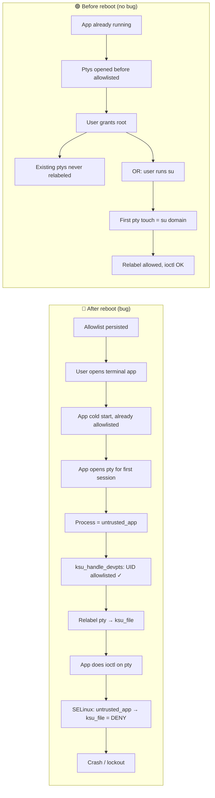
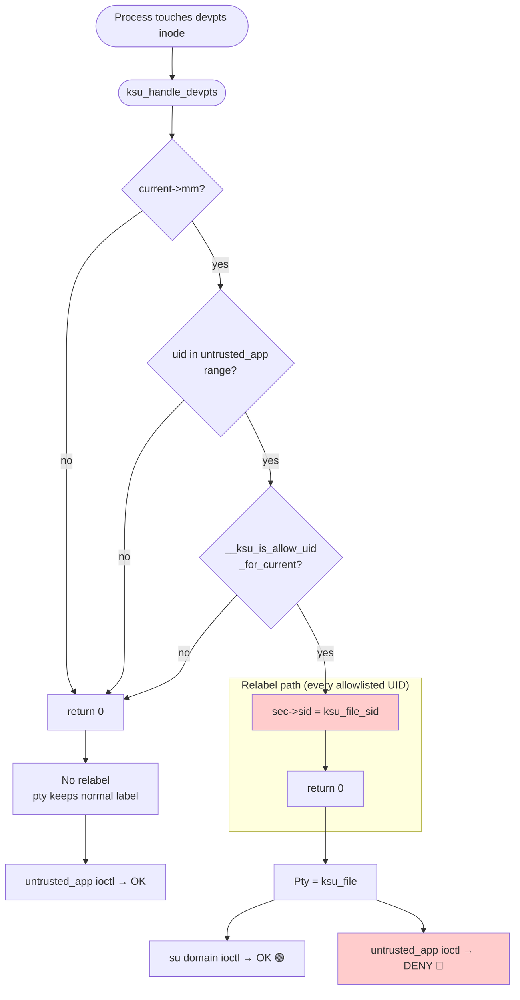
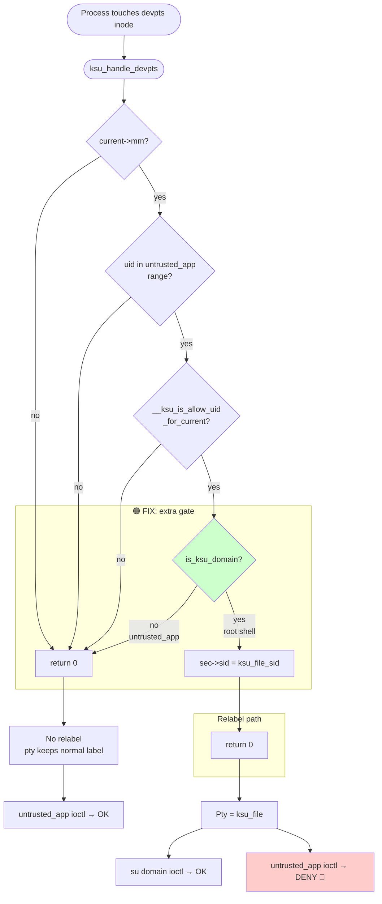
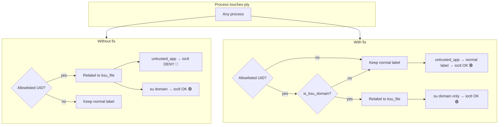

# PR: Fix terminals crash / lockout (devpts ksu_file relabel)

**SukiSU-Ultra issue:** [Terminals crash after granting root #796](https://github.com/SukiSU-Ultra/SukiSU-Ultra/issues/796)

**Note:** This issue does **not** occur on **KernelSU-Next + SUSFS**; it is specific to the **SukiSU** kernel (sukisu-4.1.1 / CONFIG_KSU_SUSFS in the SukiSU kernel tree). The PR is for **SukiSU-Ultra** only.

## Where the fix goes

Use the **builtin** branch of SukiSU-Ultra. On **main**, [kernel/sucompat.c](https://github.com/SukiSU-Ultra/SukiSU-Ultra/blob/main/kernel/sucompat.c) does **not** contain `ksu_handle_devpts`; on **builtin** it does (full SUSFS sucompat block including `ksu_handle_devpts`).

- **Repo:** [SukiSU-Ultra/SukiSU-Ultra](https://github.com/SukiSU-Ultra/SukiSU-Ultra)
- **Branch:** **builtin**
- **File:** `kernel/sucompat.c`
- **URL:** https://github.com/SukiSU-Ultra/SukiSU-Ultra/blob/builtin/kernel/sucompat.c

Open the PR against **SukiSU-Ultra/SukiSU-Ultra**, base branch **builtin**. Use **Fixes #796** in the description so the issue is linked.

---

## Root cause (short)

The issue **only happens after a reboot** when the terminal app still has su (root) permission. On first launch after reboot, the allowlisted app touches a pty; `ksu_handle_devpts()` relabels that pty inode to **ksu_file**. The app is still in **untrusted_app**; SELinux then denies ioctl on ksu_file → terminal crashes or won’t start. Fix: only relabel the pty when the **current** process is already in the **su domain** (root shell), not when it’s merely allowlisted.

### Why only after reboot?

It’s about **when** the app first touches a pty while it’s allowlisted but still in `untrusted_app`:

- **Before reboot:** You grant root to the app while it’s already running. Its existing ptys were opened *before* it was allowlisted, so they were never relabeled to `ksu_file`. Or you grant root and the next thing you do is run `su` — so the first pty touch with “root granted” is from the root shell (su domain), which is allowed. So you usually don’t hit the bad path.
- **After reboot:** The allowlist is persisted. You open the terminal app; it starts **cold** and is **already** allowlisted. The first thing it does is open a pty for the initial session. That’s the first “allowlisted UID touches a pty” — and the process is still **untrusted_app** (it never ran `su` yet). The kernel relabels that pty to `ksu_file`, then the app’s ioctl is denied → crash/lockout.

So the bug only shows up when the **first** pty touch by an allowlisted app happens while the process is still in app context. That’s exactly what you get on first launch after reboot.

---

## Detailed flow (Mermaid)

### 1. Scenario: why only after reboot?



### 2a. Old (without fix): `ksu_handle_devpts()` decision flow

After “allowlisted?” the code goes **straight to relabel** — no `is_ksu_domain?` gate. So any allowlisted UID (including `untrusted_app`) gets the pty relabeled → then untrusted_app ioctl is denied.



### 2b. With fix: `ksu_handle_devpts()` decision flow

An extra **"su domain?"** gate ensures we only relabel when the **current** process is in the su domain (root shell), not when it is merely allowlisted and still `untrusted_app`.



**Summary:** Without the fix, after `C|yes` the code goes directly to `RELABEL`, so allowlisted `untrusted_app` also gets the pty relabeled → `OUT3` (crash). With the fix, only `is_ksu_domain() == true` reaches `RELABEL`.

### 3. Summary: who gets pty relabeled?



---

## Patch to apply

**File:** `kernel/sucompat.c` (on branch **builtin**).  
**Function:** `ksu_handle_devpts()` (inside the `#else` block of `#ifndef CONFIG_KSU_SUSFS`, i.e. the SUSFS-specific sucompat code).

**Exact line numbers (builtin branch):** In [builtin/kernel/sucompat.c](https://github.com/SukiSU-Ultra/SukiSU-Ultra/blob/builtin/kernel/sucompat.c), `ksu_handle_devpts` has the same structure. Insert the new block **after** the line `return 0;` that immediately follows `if (!__ksu_is_allow_uid_for_current(uid))` and **before** the line `if (ksu_file_sid) {`. Match by the code context below if line numbers differ slightly.

**Before:**

```c
	if (!__ksu_is_allow_uid_for_current(uid))
		return 0;

	if (ksu_file_sid) {
```

**After:**

```c
	if (!__ksu_is_allow_uid_for_current(uid))
		return 0;

	/* Only relabel pty when the root shell (su domain) is using it.
	 * If we relabel when a mere allowlisted app (untrusted_app) touches
	 * the pty, SELinux denies ioctl and the terminal locks out.
	 */
	if (!is_ksu_domain())
		return 0;

	if (ksu_file_sid) {
```

`is_ksu_domain()` is already declared in `kernel/selinux/selinux.h`, which is included in the `CONFIG_KSU_SUSFS` block at the top of `sucompat.c`.

---

## PR title (suggested)

```
fix(susfs): only relabel devpts to ksu_file when in su domain (fix terminal lockout)
```

---

## PR description (suggested)

```markdown
## Problem
When root is granted to a terminal app (Termux, etc.), the app can crash or refuse to start (e.g. exit 126, or SELinux denial on ioctl). **The issue only reproduces after a reboot**, with the terminal app still having su permission (allowlisted). Before reboot, or if root is granted only after boot, the problem may not appear.

**Cause:** On first launch after reboot, the allowlisted app touches a pty; `ksu_handle_devpts()` relabels the pty inode to `ksu_file`. The app is still in `untrusted_app`; SELinux then denies ioctl on `ksu_file`, so the terminal locks out.

## Fix
Only relabel the pty when the **current** process is in the **su domain** (root shell). If the process is only allowlisted and still `untrusted_app`, do not relabel, so the pty keeps its normal label and the app can use it.

## Testing
- Reboot with root enabled for a terminal app → app starts (no ioctl denial).
- Run `su` in the app → root shell works; its pty can be relabeled when used in su domain.

Fixes #796
```

---

## Steps to open the PR

1. Fork [SukiSU-Ultra/SukiSU-Ultra](https://github.com/SukiSU-Ultra/SukiSU-Ultra).
2. Clone your fork and checkout **builtin**:
   ```bash
   git clone https://github.com/YOUR_USER/SukiSU-Ultra.git
   cd SukiSU-Ultra
   git checkout builtin
   ```
3. Open **`kernel/sucompat.c`**, find **`ksu_handle_devpts`**, and insert the 6-line block (comment + `if (!is_ksu_domain()) return 0;`) **between** the line `return 0;` that follows `if (!__ksu_is_allow_uid_for_current(uid))` and the line `if (ksu_file_sid) {`.
4. Commit, push a branch (e.g. `fix-devpts-terminal-lockout`), then open a PR against **SukiSU-Ultra/SukiSU-Ultra**, base branch **builtin**. Use **Fixes #796** in the description so the issue auto-closes when merged.
